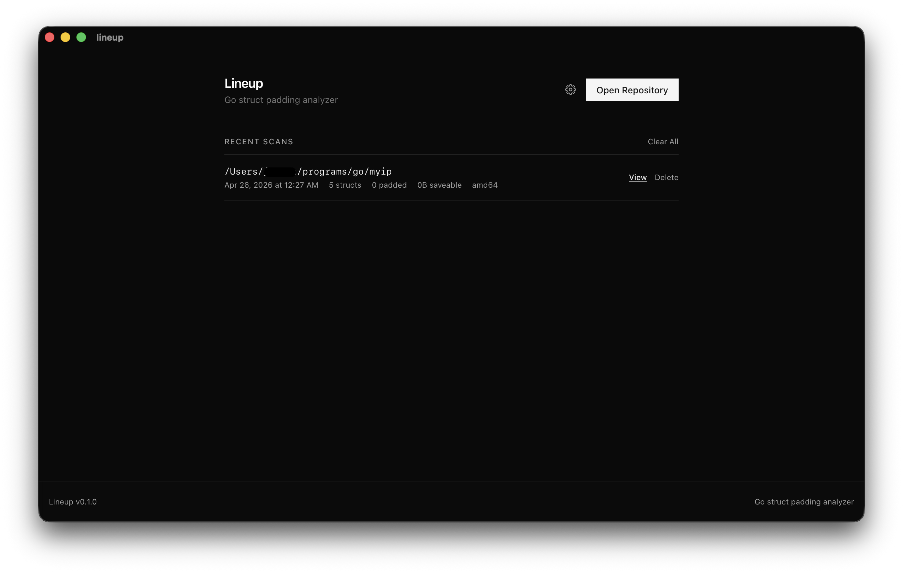
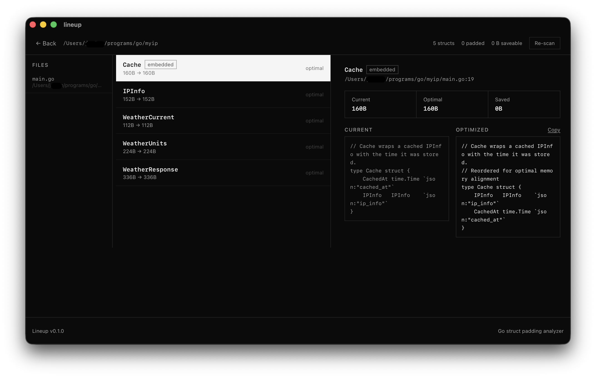

# Lineup

Lineup is a desktop app that scans Go repositories and finds `struct` types that waste memory due to field padding. It shows you exactly which structs can be improved, how many bytes can be saved, and what the optimized field order looks like — without touching your source files.

---

## What does it do?

Go aligns struct fields in memory according to their type's alignment requirements. When fields are ordered carelessly, the compiler inserts hidden padding bytes between them to satisfy alignment rules. Lineup detects this, computes the optimal field order, and tells you how much memory each struct is wasting.

No changes are made to your code. Lineup only reads and reports.

---

## Screenshots

**Home screen** — open a repository or revisit a previous scan from your history.

**Scan results** — three-pane view: file tree on the left, struct list in the center, and field-level detail on the right.

---

## Using the App

### 1. Open a repository

Click **Open Repository** on the home screen and select the root folder of any Go project. Lineup will walk the directory tree, skipping `vendor/` and files excluded by `.gitignore`.

### 2. Configure scan options

Before the scan starts you can set two options:

| Option | Description |
|---|---|
| **Architecture** | `x86_64` (default) or `ARM64`. Selects the type-size table used to calculate padding. |
| **Ignore patterns** | One regex per line. Any file whose path matches a pattern is skipped (e.g. `.*\.pb\.go$` to skip generated protobuf files). |

### 3. Read the results

The results screen has three panes:

- **Left — File tree.** Every Go file that contained at least one struct. A badge shows the number of structs with fixable padding. Click a file to filter the center list.
- **Center — Struct list.** Each card shows the struct name, current size, optimal size, and bytes that can be saved. Structs with no padding waste show `0 B saveable`.
- **Right — Detail panel.** Select a struct to see its current field order and the suggested optimized order side by side. A "Copy Optimized" button puts the reordered struct definition on your clipboard.

### 4. Understand the numbers

| Label | Meaning |
|---|---|
| **structs** | Total number of struct types found in the repository. |
| **padded** | How many of those structs currently waste at least 1 byte to padding. |
| **B saveable** | Bytes per instance that would be recovered by reordering the fields shown. |
| **~approximate** badge | The struct uses generics; sizes are estimated conservatively. |
| **embedded** badge | The struct embeds another type; sizes account for the embedded layout. |

### 5. Act on the suggestions

Lineup never modifies your source files. To apply a suggestion:

1. Click **Copy Optimized** in the detail panel.
2. Open the source file and replace the struct definition with the copied version.
3. Verify that the new order does not break anything that depends on field position — for example, `encoding/binary` reads, `unsafe.Offsetof` calls, or cgo-shared types.
4. Compile and test as normal.

### 6. Re-scan

Use the **Re-scan** button on the results screen to re-analyze the same repository (for example, after you've applied some fixes). Re-scan pre-fills the original architecture and ignore patterns so you can adjust them if needed. Each re-scan is saved as a separate history entry.

---

## Scan History

Every scan is saved locally. From the home screen you can:

- Click **View** on any history card to return to those results.
- Click the delete icon to remove a single scan record.
- Click **Clear All History** to remove all saved scans (a confirmation dialog will appear).

Scan data is stored in a SQLite database inside the app's local data directory. It never leaves your machine.

---

## Practical notes

- Lineup targets the `amd64` (x86-64) memory model by default. Switch to `ARM64` in scan options if you are building for Apple Silicon or another 64-bit ARM target. The type tables are currently identical for both; the option is plumbed through so future 32-bit target support requires no API change.
- Not every suggested reordering is appropriate. Review the proposed order before applying it, especially for structs that are serialized, passed over a network boundary, or shared with C code.
- Structs that use type parameters (generics) are flagged as `~approximate` because their concrete field sizes depend on how the type is instantiated.

---

## License

MIT. See [package.json](package.json).

---

> For developer setup, build instructions, project architecture, and the full Tauri command API reference, see [DEVELOPER.md](DEVELOPER.md).

